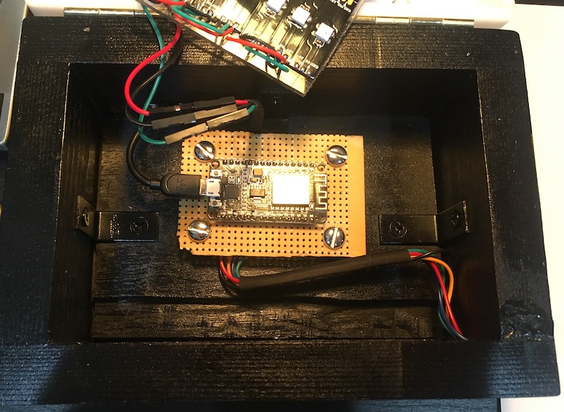

# ESP8266-Ticker

This project uses a simple [ESP8266](https://www.amazon.com/gp/product/B07HF44GBT/ref=as_li_tl?ie=UTF8&camp=1789&creative=9325&creativeASIN=B07HF44GBT&linkCode=as2&tag=knolllabs-20&linkId=a104e9eb626f87ce959f62b9588b0188) WiFi microchip to poll financial data in real time -- displaying prices on a [MAX7219](https://www.amazon.com/gp/product/B07FFV537V/ref=as_li_tl?ie=UTF8&camp=1789&creative=9325&creativeASIN=B07FFV537V&linkCode=as2&tag=knolllabs-20&linkId=72251d43862b6028423df0c48ee863ce) LED matrix reminiscent of a digital stock ticker. Additionally, there is a [WS2812B](https://www.amazon.com/gp/product/B01LSF4Q0A/ref=as_li_tl?ie=UTF8&camp=1789&creative=9325&creativeASIN=B01LSF4Q0A&linkCode=as2&tag=knolllabs-20&linkId=e0b6ec8191b828b6f4735bc985695e54) LED strip inside the project enclosure that illuminates a translucent acrylic cap. 

This always reports Bitcoin price in real time and also tracks major financial indices, representing futures data if the corresponding market is not open. 

This is a personal project of mine that I built mostly for fun, but I want to open source it in case anyone might find it useful. I will be maintaining the project here as I add more indices and customization features, as well as LED animations to represent price movements in especially volatile markets such as those backed by cryptocurrencies.

## Schematic

Here is a crude drawing of how this is all wired up.

One outstanding issue with how this project is currently wired up is that the ESP8266 is being powered by a 5V power supply when it actually requires just 3.3V. This is definitely not good practice, but for now the chip has not been fried! You should probably use a voltage regulator to accomplish this reduction for the ESP8266, while still taking advantage of the full 5V power in for the LED strip.

Here's how I have everything set up inside the enclosure... Doesn't tell you much, but the schematic above should explain all connections.

## Restful API

I built a simple API in Node.js that returns a JSON array which the ESP8266 can parse source-by-source. The device handle corresponding LED color changes as it scrolls through the sources and all of this data comes from the API. The API uses a Node package called [btc-stats](https://www.npmjs.com/package/btc-stats) to automatically get average BTC trading prices across different exchanges.

## Build

The main portion of the project enclosure is constructed out of pine wood. The LED display cover is made out of white translucent acrylic sheets. Everything was sanded down with a rotary sander to ensure all edges/corners met up and to give the project a polished look. 

The LED strip panel sits on a level above the ESP8266, the MAX7219 panels, and all of the wiring. This is to eliminate any obstructions above the LEDs that would result in large shadows on the acrylic cover. I wanted to cover as much of this surface with LED strips as I could to make it as bright as possible, and I really learned a thing or two about soldering together LED strips. You can check out the video linked below to see how I did this. The video also shows the LED panel for this project at the end.

[How to Cut, Solder, and Connect LED Strips](https://www.youtube.com/watch?v=PkWv06by0pU)

Blog post: [http://knolllabs.com/esp8266-ticker-real-time-scrolling-financial-data-on-a-max7219-led-matrix/](http://knolllabs.com/esp8266-ticker-real-time-scrolling-financial-data-on-a-max7219-led-matrix/)

